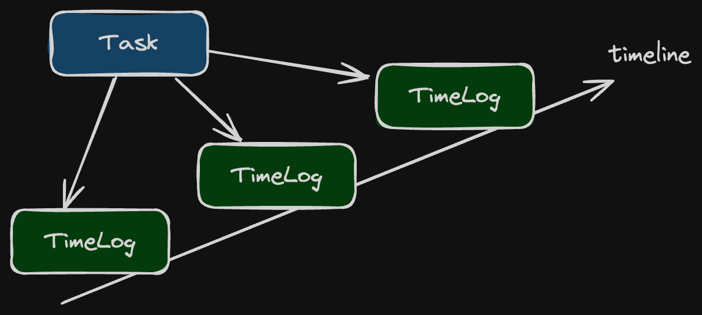

# PHP DDD Demo

This project is a simple example of how to implement Domain-Driven Design (DDD) concepts in PHP.

Without using any framework (dependency-free), focusing on the core concepts of DDD, and use cases, 
this project is a good starting point for those who want to learn more about DDD.

The demo is based on a simple task management system, where you can create tasks and log time spent on them.



tags: `domain-driven-design` `domain-event` `hexagonal-archetecture` `screaming-architecture` `clean-architecture`
`command-query-separation`

## Features

- **Entities**: Task, TimeLog
- **Value Objects**: Uuid, Duration, NonEmptyString, etc.
- **Repositories**: TaskRepository, TimeLogRepository
- **Use Cases**: CreateTask, FindTask, AddTimeLog, etc.
- **Services**: TaskCreator, TaskFinder, TimeLogCreator, etc.
- **Domain Errors**: TaskNotFound, InvalidTaskStatus, DomainError, etc.
- **Domain Events**: TaskCreated, TaskTimeLogAdded, etc.

## Setup

To run this project, you need to have PHP 8.3 or higher installed on your machine.

```bash
git clone git@github.com:yceruto/php-ddd-demo.git
cd php-ddd-demo
composer install
```

## Testing

Unit tests are implemented using PHPUnit. To run the tests, execute the following command:

```bash
vendor/bin/phpunit
```

## License

This software is published under the [MIT License](LICENSE)
